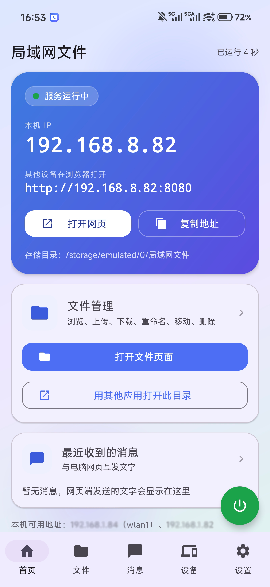
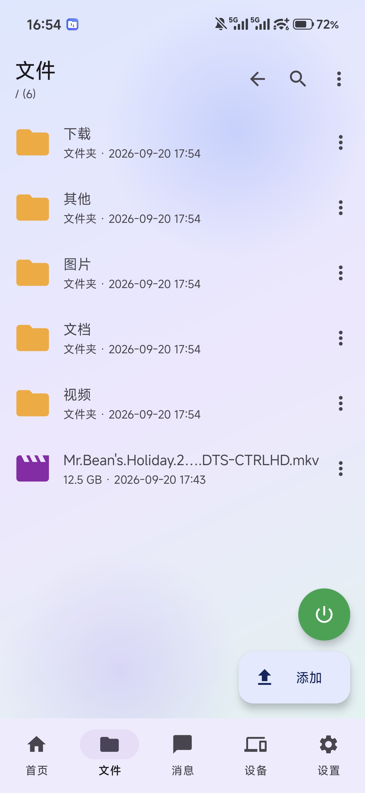
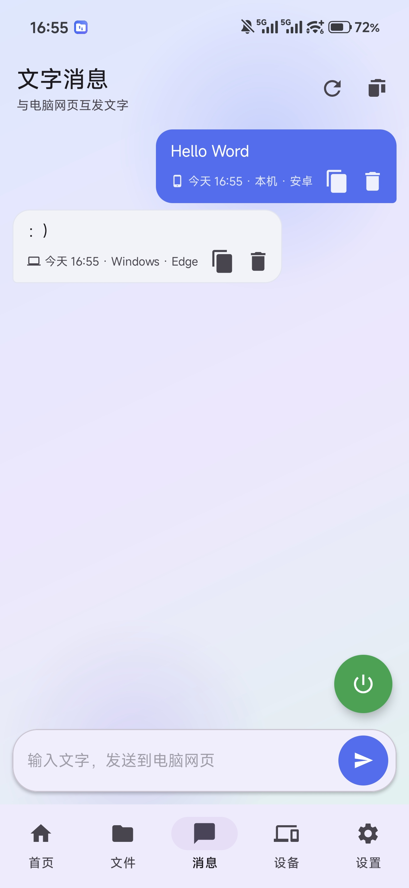
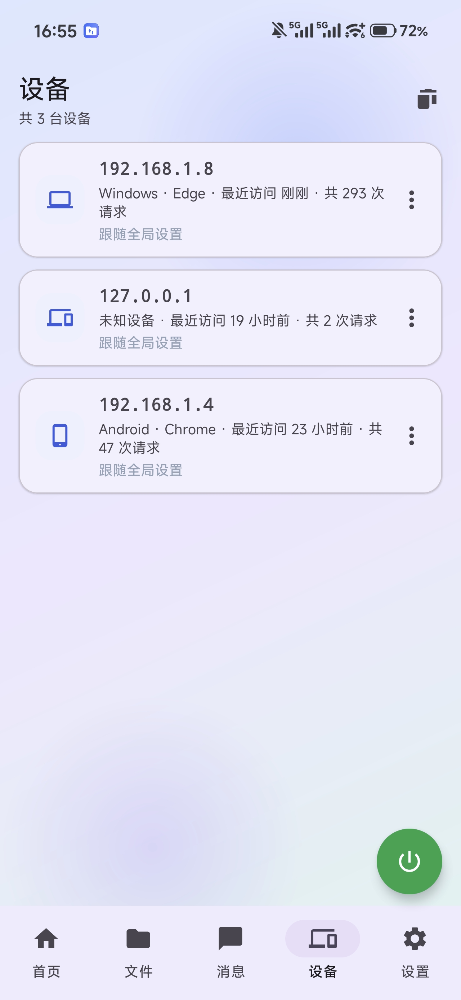
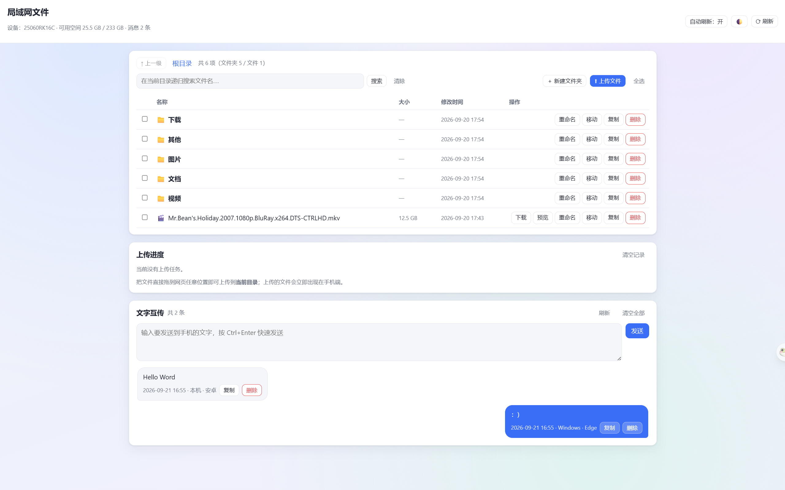

<div align="center">

# 局域网文件 · LanFile

**把手机变成一台局域网文件服务器**

手机与电脑 / 平板通过浏览器直接访问同一个文件目录，
文件、图片和文字可以在局域网内快速互传。

无需云端，无需账号，无需在电脑上安装额外软件。

[](#-快速开始)
[](#-技术栈)
[](#-说明)


</div>

---

## 📸 截图

<p align="center">
  
  
  
  
</p>

电脑端无需安装软件，使用浏览器直接访问：



---

## ✨ 功能

### 📱 手机端

* 查看局域网访问地址与服务状态
* 文件浏览、搜索、排序
* 新建、复制、移动、重命名、删除文件
* 图片 / 文本在线预览
* 多选与批量操作
* 导入、分享、打开文件
* 手机与网页之间发送文字
* 访问设备管理、封禁与权限控制
* 深色 / 浅色主题
* 支持后台运行

### 🌐 网页端

* 浏览手机文件
* 上传 / 下载文件
* 支持拖拽上传
* 显示上传进度、速度与剩余时间
* 支持断点续传
* 文件删除、重命名、新建文件夹
* 文件复制 / 移动
* 递归搜索
* 图片 / 文本预览
* 手机 ↔ 电脑文字互传
* 自适应电脑与手机浏览器

### ⭐ 项目特点

**同一个目录**
手机端和网页端操作的是同一份文件，不需要额外同步。

**完全局域网**
数据直接在设备之间传输，不依赖云服务。

**无需电脑安装客户端**
只需要一个浏览器即可访问。

**大文件友好**
采用流式传输，支持 Range 断点续传。

---

## 🚀 快速开始

### 1. 安装

从 [Releases](../../releases) 下载 APK。

要求：

* Android 8.0（API 26）及以上

### 2. 启动服务

打开 App，首页会显示类似：

```text
http://192.168.1.100:7800
```

看到服务运行后，用同一局域网内的电脑或平板打开这个地址即可。

### 3. 开始传文件

打开网页后，可以直接：

* 上传文件
* 下载文件
* 管理文件
* 发送文字

手机端和网页端看到的是同一个目录。

---

## 📂 文件目录

默认使用：

```text
内部存储/
└─ 局域网文件/
   ├─ 图片/
   ├─ 视频/
   ├─ 文档/
   ├─ 下载/
   └─ 其他/
```

网页端只能访问这个目录中的内容，不会直接暴露手机其它位置。

---

## 🔒 权限与安全

LanFile 主要面向**可信的局域网环境**。

目前网页端**没有账号密码鉴权**。
同一局域网内能够访问服务地址的设备，都可能访问网页端开放的功能。

因此不建议直接暴露到公网。

同时，App 提供设备管理功能，可以查看访问设备，并对设备进行：

* 封禁
* 单独允许 / 禁止上传
* 单独允许 / 禁止删除
* 单独允许 / 禁止文件修改
* 单独允许 / 禁止文字互传

---

## ⚙️ 设置

App 支持自定义：

* 主题
* 默认打开页面
* 服务端口
* 网页端标题
* 网页端功能开关
* 单文件上传限制
* 存储目录
* 后台运行
* 自动启动
* 通知

默认端口为 `7800`。
如果端口被占用，会自动尝试使用后续端口。

---

## 🛠 技术栈

* Kotlin 2.2
* AndroidX
* Material
* Kotlin Coroutines
* 自研轻量 HTTP/1.1 服务
* 原生 HTML / CSS / JavaScript 网页端

网页端不依赖 CDN、外部字体或第三方脚本，可在没有外网的情况下使用。

---

## 🔧 自行编译

需要：

* Android Studio
* JDK 17–21
* Android SDK 37

Windows：

```bash
gradlew.bat :app:assembleDebug
```

macOS / Linux：

```bash
./gradlew :app:assembleDebug
```

APK 输出位置：

```text
app/build/outputs/apk/debug/app-debug.apk
```

也可以直接使用 Android Studio 打开项目根目录后运行。

---

## ⚠️ 已知限制

* 当前网页端无账号密码鉴权
* 主要面向局域网使用，不建议直接暴露到公网
* 视频 / 音频在 App 内会调用系统应用打开
* 网页端拖拽上传暂不支持直接递归上传文件夹
* 预览目前主要支持图片与文本
* 部分 Android 版本可能需要额外授予存储或本地网络权限
* 设备识别主要基于客户端 IP，因此 IP 变化后可能被识别为新设备

---

## 📄 说明

本项目为个人项目，目前**未附加开源许可证**。

欢迎转载、修改或二次分发

LanFile 不依赖云端服务，文件与文字主要在你的设备和局域网内流转。

欢迎提交 Issue 反馈问题或交流使用体验。

如果这个项目对你有帮助，欢迎点个 ⭐。

## AI 使用说明

本项目部分代码、功能设计及文档内容由 AI 辅助生成，并经过作者修改、测试和整理。


<div align="center">
<sub>Made with Kotlin & a hand-written HTTP server.</sub>
</div>
